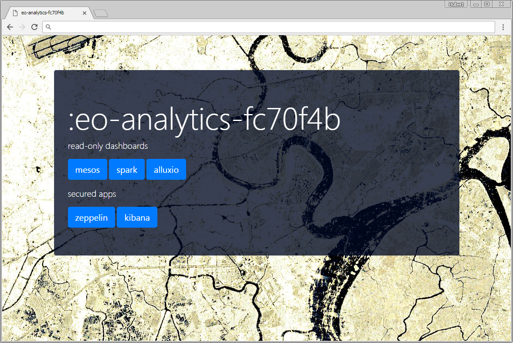

processing backend on AWS
=========================
Playbooks and roles for deployment on Amazon Web Services IaaS (AWS)

## what you need
- ansible control host with internet access (preferably linuxOS)
- python, pip, ansible, awscli (for interaction with S3 and boto-dependency) installed
  ```sh
  # e.g. for centos...
  yum -y update
  yum -y install epel-release
  yum -y update
  yum -y install python-pip jq
  pip install --upgrade pip
  pip install awscli certifi
  ```
- AWS privileged account (admin-role)
- AWS Access keys
  - user-access keys consist of `access_key_id` and  `secret_access_key` and must be generated within the AWS web-console. 
- AWS-static conf needed:
    - existing ssh-key, linked to existing AWS key-pair
    - IAM-Role for RoleBasedAccessControl (RBAC) to all kinds of AWS services

## provision your own cluster

### prepare your control host
Your control host (a linux host where ansible is installed to communicate with the cloud-APIs to create something like a mesos/spark cluster), which could be your office-client computer, or a VirtualboxVM, or some plain normal on-premise linux server must have access to the cloud-providers API-endpoints. In our case we need access (https) to the AWS-API servers. Mandatory packages to be installed on control host are:
- git, epel, python(2.7++), python-pip, ansible, awscli

### generate AWS key-pair & copy to control-host
To create VM's within AWS and ssh to them, you have to create a key-pair within the AWS webPortal.
- create key-pair in AWS-webUI
- download key and copy to control host
- change key's UNIX permissions to 0600

### clone this repo to the control host
```bash
git clone https://github.com/asamerh4/eo-analytics.git
cd eo-analytics/processing-backends/aws
```

### edit or create `vars/main.yml`
Do not edit lines containing `{{ variable }}` 
```python
---
######################################################
###################Edit HERE!!! - START###############

#your aws credentials
aws_access_key_id: xxxxxxxxxxxxxx
aws_secret_access_key: xxxxxxxxxxxxx

#name of cluster
cluster_id: "{{ cluster_id }}"

#ec2 instance type
ec2_flavour: r4.large

#ansible-created image (produced from createAMI.sh)
image_id: xxxxxxxxxxxx

#your prepared role in aws-iam-console for e.g. permissions on buckets
#used for e.g. s3-access from worker nodes without a need to provide credentials
iam_role: xxxxxxxxxxxx


##################Edit HERE!!! - END##################
######################################################

alluxio_block_size: "{{ alluxio_block_size }}"
alluxio_underfs_s3: "{{ alluxio_underfs_s3 }}"
alluxio_ramfs_size_gb_std: 12
alluxio_ramfs_size_gb_big: 100
aws_region: eu-central-1
aws_subnet_az: eu-central-1b
ec2_disk_size: 10
base_image_id: ami-337be65c
mesos_cluster_name: "{{ cluster_id }}"
aws_ssh_key_name: "{{ aws_ssh_key_name }}"
ramdisk_gb: 10
subnet_cidr_masters: 192.168.0.0/24
subnet_cidr_agents: 192.168.1.0/24
subnet_cidr_templates: 192.168.2.0/24
subnet_dns1: 100.125.4.25
subnet_dns2: 8.8.8.8
subnet_gate: 192.168.0.1
vpc_cidr: 192.168.0.0/16
vpc_nexthop_ip: 192.168.0.200
vpc_toplevel_name: "{{ cluster_id }}"
```

### optionally build machineImage (AMI)
The script in `scripts/createAnalyticsAMI.py` is used to automate the creation of an AWS machineImage, which is used to form a cluster. Start the script from the repo's root dir (or use createAMI.sh directly):
```bash
#!/bin/bash
set -ex

BUILD=$(git rev-parse --short HEAD)
CLUSTER_NAME="template"
YELLOW='\033[1;33m'
NC='\033[0m' # No Color

echo -e ${YELLOW}"**building analytics machine Image..."${NC}

rm -rf ~/.ansible
python \
 scripts/createAnalyticsAMI.py \
 -k "/home/dev1/mesos140.pem" \
 -ok mesos140 \
 -u centos \
 eu-central-1 \
 $CLUSTER_NAME"-"$BUILD
```

Once finished, the resulting AMI is available within your AWS-account and contains the following main components:
- systemd services (all disabled by default):
   - zookeeper
   - mesos-master
   - mesos-agent
   - docker-engine
   - alluxio-master
   - alluxio-worker
   - alluxio-proxy
   - nginx
   - spark-shuffle-service
- prepared frameworks:
   - spark (/opt/spark)
   - alluxio (/opt/alluxio)
   - zeppelin

These components act as the single base of all subsequent generated VM-instances. All service configuration we defined in `vars/main.yml` is injected when the cluster playbook is executed. (see next step)

`Note:` when customizing the machineImage (`tasks/machineImage.yml`), keep in mind that you should only add/install packages which are used by all VM-types in our cluster. (e.g. masters, agents, edge-nodes). Also the resulting image size is quite important. Larger images (+2GB) tend to have significant longer deployment-times than lean ones. (~1GB)

### create cluster
Now we have everything ready for creating a cluster with 1 master and 1 agent (=initial autoscaling group size). You may also run cluster_up_aws.sh directly
```bash
#!/bin/bash
set -ex

BUILD=$(git rev-parse --short HEAD)
CLUSTER_NAME="analytics"
YELLOW='\033[1;33m'
NC='\033[0m' # No Color

echo -e ${YELLOW}"**building cluster $CLUSTER_NAME"-"$BUILD"${NC}

rm -rf ~/.ansible
python scripts/cluster_deploy.py \
  -z \
  -m \
  -s3 "s3a://s2-sync" \
  -b 800 \
  -k "~/mesos140.pem" \
  -ok mesos140 \
  -u centos \
  eu-central-1 \
  $CLUSTER_NAME"-"$BUILD \
  provision
```
example ansible output (omitted):
```
PLAY [localhost] ***************************************************************

TASK [Gathering Facts] *********************************************************
ok: [localhost]
...
...
TASK [asconfig_create : Create ASConfig] ***************************************
skipping: [localhost]

TASK [asgroup_create : Create ASGroup] *****************************************
skipping: [localhost]

TASK [asgroup_create : Enable AS-Group] ****************************************
skipping: [localhost]

TASK [vpc_disable_checks : Request VPC-ports from API] *************************
ok: [localhost]

TASK [vpc_disable_checks : Disable source/destination check of master] *********
ok: [localhost]

PLAY RECAP *********************************************************************
18.XXX.XXX.101             : ok=49   changed=9    unreachable=0    failed=0
localhost                  : ok=83   changed=4    unreachable=0    failed=0
```

### point your browser to the cluster-dashboard
Ansible shows the public-IP of our mesos-master, which acts also as a lean nginx-server via https. Read-only dashboards of alluxio, mesos, spark & zeppelin are reverse-proxied and available via the internet. This is especially useful when working with spark.

`Caution`: no auth-solution is deployed so far. For more production-like deployments consider to lock down this nginx-server, with e.g. oauth

The nginx-ssl config uses a self-signed certificate. Modern browsers raise some security warnings about this. If you plan to maintain a permanent solution, then get your trusted cert, get a free domain, and so on... 

The landing page looks like this:


```
https://PUBLIC-IP/
           |----> state.json # mesos-state info
           |----> spark      # spark-UI, when active spark-context on internal port 4040
           |----> alluxio    # alluxio-UI
           |----> zeppelin   # zeppelin
```

### some security notes
The only public accessible interfaces to our cluster are:
- ssh to mesos-master with ssh-key (via port 22)
- https to mesos-master (via port 443)

All agent nodes in the autoscaling group do not have public IP's
- only the internal mesos-master IP has access to the private agents
- ssh to agents is only possible from mesos-master by using our ssh-key

network and security groups topology:
```
VPC (192.168.0.0/16)
|- subnet (192.168.0.0/24)
|   |- public-group
|   |  |-Inbound (TCP): port 22, 443 for remote end 0.0.0.0/0 (world)
|   |  |-Inbound (TCP): port 1024-60000 for remote end 192.168.1.0/24 (agent-subnet)
|   |  |-Outbound (Any): any port for remote end 0.0.0.0/0 (world)
|   |
|   |- master-group
|   |  |-Inbound (TCP): port 5050, 19999, 39999 for remote end 192.168.1.0/24 (agent-subnet)
|   |  |-Outbound (Any): any port for remote end 0.0.0.0/0 (world)
|   |
|   |- zookeeper-group
|      |-Inbound (TCP): port 3888, 2181, 2888 for remote end 192.168.1.0/24 (agent-subnet)
|      |-Outbound (Any): any port for remote end 0.0.0.0/0 (world)
|   
|- subnet (192.168.1.0/24)
    |- agent-group
       |-Inbound (TCP): port 22, 1024-60000 for remote end 192.168.0.0/24 (master-subnet)
       |-Outbound (Any): any port for remote end 0.0.0.0/0 (world)   
```
mapping of sec-topology to VM-deployment:
```
mesos-masters
|-public-group
|-master-group
|-zookeeper-group

mesos-agents (autoscaling group)
|-agent-group
```


