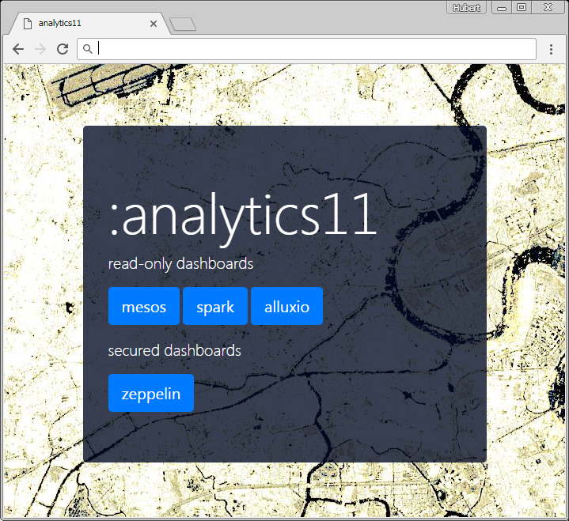

processing backend on OTC
=========================
Playbooks and roles for deployment on Open Telekom Cloud (OTC)

## what you need
- ansible control host with internet access (preferably linuxOS)
- python, pip, ansible, awscli (for interaction with S3 and boto-dependency) installed
  ```sh
  # e.g. for centos...
  yum -y update
  yum -y install epel-release
  yum -y update
  yum -y install python-pip jq
  pip install --upgrade pip
  pip install awscli certifi
  ```
- OTC privileged account (admin-role)
- proper `clouds.yml` config in ~/.config/openstack/clouds.yml
  * Example of clouds.yml:
    ```yaml
    clouds:
      otc:
        auth:
          auth_url: https://iam.eu-de.otc.t-systems.com:443/v3
          username: -your-otc-privileged-username-
          password: -your-otc-privileged-username-password-
          project_name: eu-de
          project_domain_name: -your-domain-id- (e.g.8834sdfec3cc84120aac157xyz1234)
          user_domain_name: -your-domain-name- (e.g. OTC-EU-DE-0000000000xxxxxx)
        region_name: eu-de
    ```
- OTC Access keys with read/write permissions for S3
user-access keys consist of `access_key_id` and  `secret_access_key` and must be generated within the OTC web-console. It's recommanded to generate a seperate user with read/write permissions to OBS (S3) 
- OTC-static conf needed:
    - existing ssh-key, linked to existing OTC key-pair
    - OTC Machine-Image (Image-ID)
       - centos7.2-docker1.17-mesos1.4.0-jenkins2.79-alluxio1.6-https
       - centos7.2 with docker engine 1.17, mesos 1.4.0, alluxio 1.6 jenkins 2.7, awscli, nginx (public readonly sites via ssl), no firewalld, no selinux, some network tweaks, iptables service, ip forwarding, all mentioned core services are disabled by default
       - shared with you within OTC `on request`

## provision your own cluster
As a prerequisite to run some spark eo workloads you should have some form of mesos/alluxio cluster running. Mesos acts as the execution base-platform - think of general purpose resource scheduling.

### prepare your control host
Your control host (a linux host where ansible is installed to communicate with the cloud-APIs to create something like a mesos/spark cluster), which could be your office-client computer, or a VirtualboxVM, or some plain normal on-premise linux server must have access to the cloud-providers API-endpoints. In our case we need access (https) to the OTC-API servers. Mandatory packages to be installed on control host are:
- git, epel, python(2.7++), python-pip, ansible, awscli

### generate OTC key-pair & copy to control-host
To create VM's within OTC and ssh to them, you have to create a key-pair within the OTC webPortal.
- create key-pair in OTC-webUI
- download key and copy to control host
- change key's UNIX permissions to 0600

### clone this repo to the control host
```bash
git clone https://github.com/asamerh4/eo-analytics.git
cd eo-analytics/processing-backends/otc
```

### edit or create `vars/main.yml`
Do not edit lines containing `{{ variable }}` 
```python
---
alluxio_block_size: "{{ alluxio_block_size }}"
alluxio_underfs_s3: "{{ alluxio_underfs_s3 }}"
# size of alluxio ramdisk on every worker
alluxio_ramfs_size_gb_std: 12
alluxio_ramfs_size_gb_big: 100
availability_zone: "eu-de-02"
# OTC-access keys used for OTC-S3 (same nomenclature as in aws ;-))
aws_access_key_id: "ZJNJJYYYYYYXXXYYYKC1FNH"
aws_secret_access_key: "D2Em8ZZZZZZZZZZZZXXXXZZZZZZZt2bfMcZ"
cluster_id: "{{ cluster_id }}"
# size of VM root volume (OTC)
ecs_disk_size: "10"
# VM's root volume disk type (OTC)
ecs_disk_type: "SSD"
# VM type (2 cores 16GB RAM)
ecs_flavour: "highmem2"
# VM-OTC-Image (derived `scripts/otc_create_machine_image.py`)
image_id: "eb35e995-ff00-4661-a7bd-04032ae1a569"
# base image, when building image using `scripts/otc_create_machine_image.py`
base_image_id: "d1a4e2fc-6b30-4d2b-97e9-e343a2d3d2b7"
mesos_cluster_name: "{{ cluster_id }}"
otc_ssh_key_name: "{{ otc_ssh_key_name }}"
# size of ramdisk mainly for container working dirs `/var/lib/docker`
ramdisk_gb: "10"
# OTC VPC config
subnet_cidr: "192.168.0.0/24"
subnet_dns1: "100.125.4.25"
subnet_dns2: "8.8.8.8"
subnet_gate: "192.168.0.1"
vpc_cidr: "192.168.0.0/16"
vpc_nexthop_ip: "192.168.0.2"
vpc_toplevel_name: "{{ cluster_id }}"
```

### optionally build machineImage
The script in `scripts/otc_create_machine_image.py` is used to automate the creation of an OTC machineImage, which is used to form a spark/alluxio/mesos cluster. Start the script from the repo's root dir:
```bash
python scripts/otc_create_machine_image.py -k "~/mesos130-api.pem" -ok mesos130-api -u linux eu-de
```
Once finished, the resulting VM-image is available within your OTC-account (=tenant) and contains the following main components:
- systemd services (all disabled by default):
   - zookeeper
   - mesos-master
   - mesos-agent
   - docker-engine
   - alluxio-master
   - alluxio-worker
   - alluxio-proxy
   - nginx
   - spark-shuffle-service
- prepared frameworks:
   - spark (/opt/spark)
   - alluxio (/opt/alluxio)
   - zeppelin

These components act as the single base of all subsequent generated VM-instances. All service configuration we defined in `vars/main.yml` is injected when the cluster playbook is executed. (see next step)

`Note:` when customizing the machineImage (`tasks/machineImage.yml`), keep in mind that you should only add/install packages which are used by all VM-types in our cluster. (e.g. masters, agents, edge-nodes). Also the resulting image size is quite important. Larger images (+2GB) tend to have significant longer deployment-times than lean ones. (~1GB)

### create cluster
Now we have everything ready for creating a cluster with 1 master and 1 agent (=initial autoscaling group size)
```bash
cd processing-backends/otc
python scripts/otc_deploy.py -z -m \
# OTC-S3 bucket which is used as alluxio underFS
  -s3 "s3a://alluxio-tests/tests" \
# alluxio inmemoryFS block size in MB
  -b 4 \
# our ssh-key
  -k "~/mesos130-api.pem" \
# our ssh-key name within otc
  -ok mesos130-api \
# user inside VM
  -u linux \
# otc region
 eu-de \
# cluster name
 analytics11 \
# provision means provision
 provision
```
example ansible output (omitted):
```
PLAY [localhost] ***************************************************************

TASK [Gathering Facts] *********************************************************
ok: [localhost]
...
...
TASK [asconfig_create : Create ASConfig] ***************************************
skipping: [localhost]

TASK [asgroup_create : Create ASGroup] *****************************************
skipping: [localhost]

TASK [asgroup_create : Enable AS-Group] ****************************************
skipping: [localhost]

TASK [vpc_disable_checks : Request VPC-ports from API] *************************
ok: [localhost]

TASK [vpc_disable_checks : Disable source/destination check of master] *********
ok: [localhost]

PLAY RECAP *********************************************************************
80.158.16.5                : ok=49   changed=9    unreachable=0    failed=0
localhost                  : ok=83   changed=4    unreachable=0    failed=0
```

### point your browser to the cluster-dashboard
Ansible shows the public-IP of our mesos-master, which acts also as a lean nginx-server via https. Read-only dashboards of alluxio, mesos, spark & zeppelin are reverse-proxied and available via the internet. This is especially useful when working with spark.

`Caution`: no auth-solution is deployed so far. For more production-like deployments consider to lock down this nginx-server, with e.g. oauth

The nginx-ssl config uses a self-signed certificate. Modern browsers raise some security warnings about this. If you plan to maintain a permanent solution, then get your trusted cert, get a free domain, and so on... 

The landing page looks like this:


```
https://PUBLIC-IP/
           |----> state.json # mesos-state info
           |----> spark      # spark-UI, when active spark-context on internal port 4040
           |----> alluxio    # alluxio-UI
           |----> zeppelin   # zeppelin
```

### some security notes
The only public accessible interfaces to our cluster are:
- ssh to mesos-master with ssh-key (via port 22)
- https to mesos-master (via port 443)

All agent nodes in the autoscaling group do not have public IP's
- only the internal mesos-master IP has access to the private agents
- ssh to agents is only possible from mesos-master by using our ssh-key

network and security groups topology:
```
VPC (192.168.0.0/16)
|- subnet (192.168.0.0/24)
   |- public-group
   |  |-Inbound (TCP): port 22, 443 for remote end 0.0.0.0/0 (world)
   |  |-Inbound (TCP): port 1024-60000 for remote end 192.168.0.0/24 (subnet)
   |  |-Outbound (Any): any port for remote end 0.0.0.0/0 (world)
   |
   |- master-group
   |  |-Inbound (TCP): port 5050, 19999, 39999 for remote end 192.168.0.0/24 (subnet)
   |  |-Outbound (Any): any port for remote end 0.0.0.0/0 (world)
   |
   |- zookeeper-group
   |  |-Inbound (TCP): port 3888, 2181, 2888 for remote end 192.168.0.0/24 (subnet)
   |  |-Outbound (Any): any port for remote end 0.0.0.0/0 (world)
   |
   |- agent-group
      |-Inbound (TCP): port 22, 1024-60000 for remote end 192.168.0.0/24 (subnet)
      |-Outbound (Any): any port for remote end 0.0.0.0/0 (world)
```
mapping of sec-topology to VM-deployment:
```
mesos-masters
|-public-group
|-master-group
|-zookeeper-group

mesos-agents (autoscaling group)
|-agent-group
```


