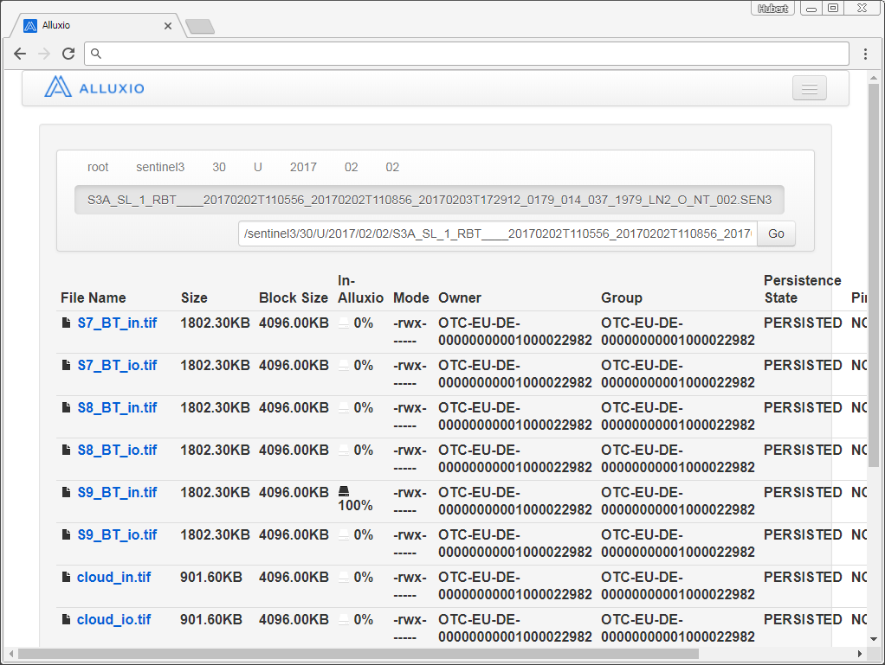
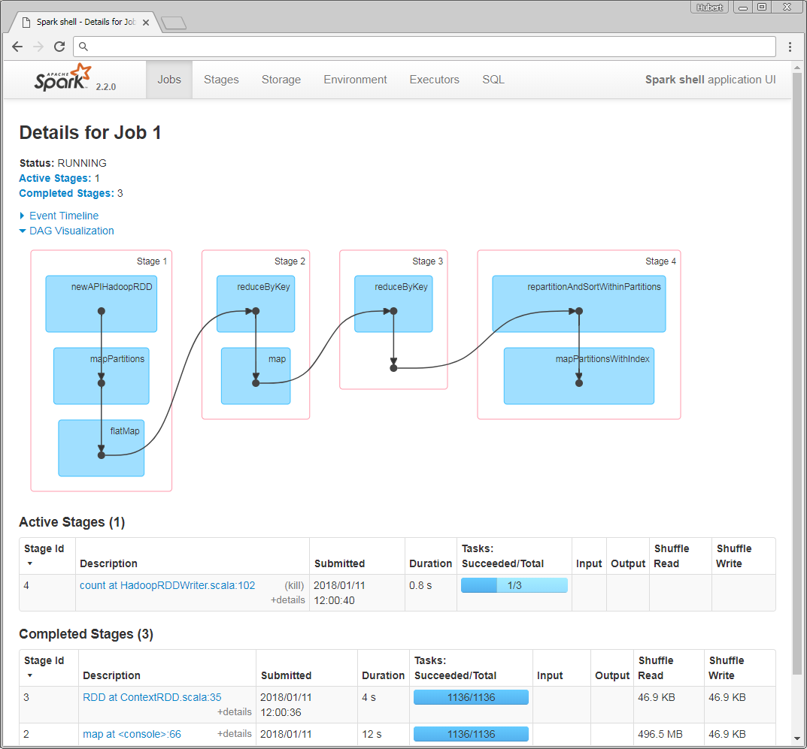
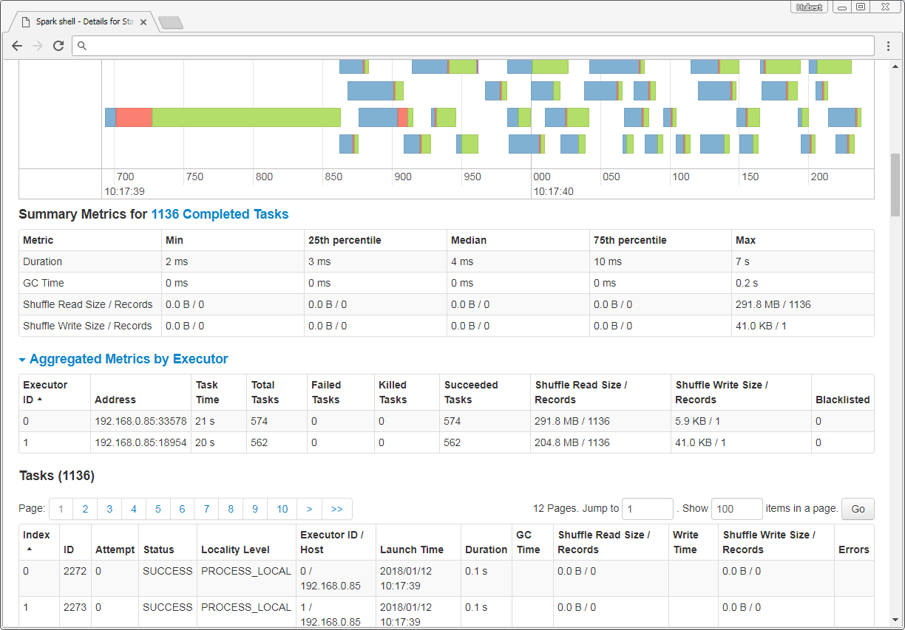
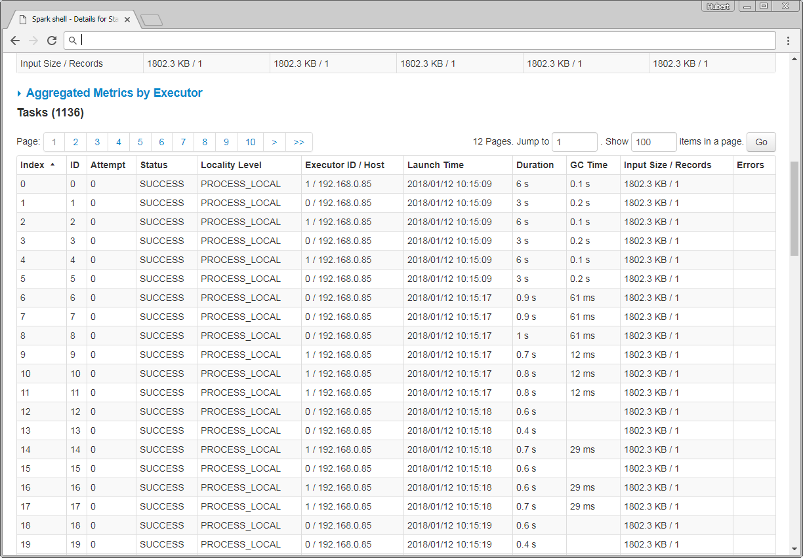
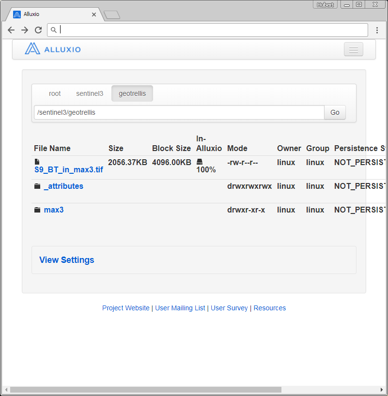
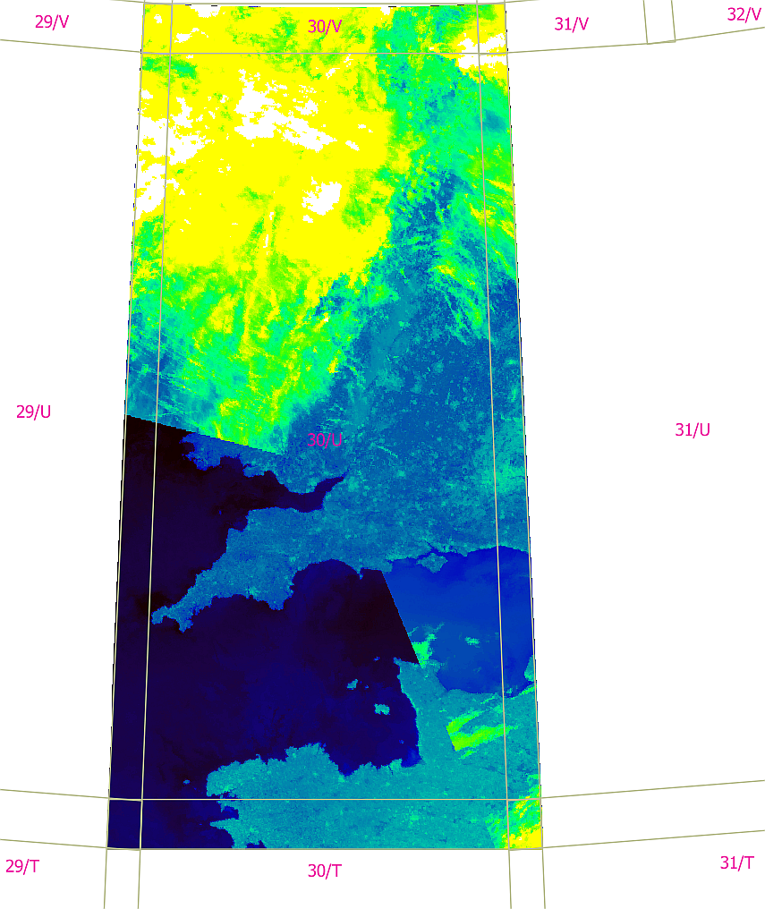

# Sentinel-3 spark-mesos demo
The following steps could be seen as an end-to-end tutorial from preparing a control host to bootstrap a cluster within the cloud and to the actual interesting part: `writing eo spark-workflows in scala.`

## pre step 1: where is the input eo data?
This step is completely decoupled from the whole cluster/spark/mesos/kubernetes... stuff. Copy your eo-data to the Cloud-provider's object-storage. This is in all cases some form/derivate of `S3`
- the copy process itself should be done using e.g. aws-cli, which also works really well for OTC-S3
- when trying to upload huge amounts (+100TB) of data, consider alternative approaches, like exposing your data to some https-get endpoint, use datahubs like `code-de` or `esa sentinel sci hubs`  and pull this data from within the cloud (e.g. from an ingestion batch-system like in [asamerh4/sentinel3-s3-ingestion-pipeline](https://github.com/asamerh4/sentinel3-s3-ingestion-pipeline)). Some cloud providers offer import/export appliances (e.g. AWS-snowball), but that's another story
- try to structure your data within a S3-bucket with meaningful and human readable `spatiotemporal indexes`.
  -  if your data is already geo-referenced in some form, try to press it through a standardized tiling system, like MGRS or any other rectangular `{x/y/z}` system.
  - an index (=folder structure within S3-bucket) could start with spatial info, continued by a temporal part and finished with product specific infos...
  - these object storage indexes do have significant impact on I/O throughput. Construct such a structure based on your future analytics use cases. Higher index level diversity guarantees better balancing on the S3-backend service. ~
  - like so: /sentinel3/30/U/2017/08/07/S3A_SL_1_RBT____20170807T220927_20170807T221227_20170808T004159_0179_021_001_0719_SVL_O_NR_002.SEN3/S9_BT_io.tif
  - like in: [asamerh4/sentinel3-to-utm-pipeline](https://github.com/asamerh4/sentinel3-to-utm-pipeline)

### Demo S3-bucket seen with alluxio
Alluxio is used as distributed FS between worker-nodes. It has hadoop-comapitible API's and follows the same principles as hdfs - but all in RAM.



## step 1: enter SPARK
Now we're ready to ssh into our mesos-master and start a spark-shell. This demo invokes the spark-shell which registers as a mesos-framework using the `--master` commandline parameter. All required scala/java classes for working with the data (from S3 and alluxio) are assembled to a so called `fat-jar` and referenced using the `--jars` parameter. When spark starts in client mode (default) these jars are automatically synced to all agents (mesos worker nodes).

### clone spark/gdal/geotrellis repo & build a fat-jar

The repo in [asamerh4/spark-eo-testbed](https://github.com/asamerh4/spark-eo-testbed) contains a scala project and is used to assemble all dependencies like geotrellis et al. to a single jar file. When `build.sh` is executed, a docker image for assembling the jar file is built. The jar file is then copied out from the container to the current path.

```sh
ssh -i "{{ ssh-key }}" linux@{{ mesos-master-PublicIP }}
git clone https://github.com/asamerh4/spark-eo-testbed.git
cd spark-eo-testbed
./build.sh
```

## start spark-shell

```sh
# get private IP (mesos-master is bound to our private IP)
MESOS_MASTER=$(hostname -I | awk -F " " '{print $1}')
/opt/spark/bin/spark-shell \
  --master mesos://$MESOS_MASTER:5050 \
  --jars /home/linux/spark-eo-testbed/testbed-assembly-1.0.jar \
  --conf spark.executor.cores=1
...
...
I0111 12:23:48.656080 87108 sched.cpp:759] Framework registered with 56dd8314-a408-4ee3-8c89-8e116fd699fd-0002
18/01/11 12:23:49 WARN MesosCoarseGrainedSchedulerBackend: Unable to parse  into a key:value label for the task.
18/01/11 12:23:49 WARN MesosCoarseGrainedSchedulerBackend: Unable to parse  into a key:value label for the task.
18/01/11 12:23:54 WARN ObjectStore: Failed to get database global_temp, returning NoSuchObjectException
Spark context Web UI available at http://192.168.0.36:4040
Spark context available as 'sc' (master = mesos://192.168.0.36:5050, app id = 56                             dd8314-a408-4ee3-8c89-8e116fd699fd-0002).
Spark session available as 'spark'.
Welcome to
      ____              __
     / __/__  ___ _____/ /__
    _\ \/ _ \/ _ `/ __/  '_/
   /___/ .__/\_,_/_/ /_/\_\   version 2.2.0
      /_/

Using Scala version 2.11.8 (OpenJDK 64-Bit Server VM, Java 1.8.0_151)
Type in expressions to have them evaluated.
Type :help for more information.

scala>
```
## REPL inserts

Enter the following lines to the interactive spark-shell, which is a so called `Read–Eval–Print Loop` (line by line or paste the whole block). Each line is evaluated and executed like you propably know from interactive notebooks like jupyter or zeppelin.
```scala
import alluxio.master.MasterClientConfig;
import geotrellis.raster._
import geotrellis.raster.io.geotiff._
import geotrellis.raster.resample._
import geotrellis.spark._
import geotrellis.spark.io._
import geotrellis.spark.io.hadoop._
import geotrellis.spark.io.index.ZCurveKeyIndexMethod
import geotrellis.spark.tiling._
import geotrellis.util._
import geotrellis.vector.{Extent, ProjectedExtent}
import java.net.URI
import java.time.{LocalDateTime, ZoneId}
import org.apache.hadoop.fs.Path
import org.apache.spark.HashPartitioner
import org.apache.spark.rdd.RDD
import testbed.BiasedImplicits._


val alluxio_master = MasterClientConfig.defaults.getMasterInquireClient.getMasterRpcAddresses.get(0).toString
implicit val sparkContext = sc
val tiffs: RDD[(TemporalProjectedExtent, Tile)] = HadoopGeoTiffRDD[ProjectedExtent, TemporalProjectedExtent, Tile](
  path = new Path("alluxio:/"+alluxio_master+"/sentinel3/30/U/*/*/*/*/S9_BT_in.tif"), 
  uriToKey = (uri: URI, pe: ProjectedExtent) => { 
    // get from uri the temporal component, where uri is a path to each geotiff
    val uriParts1 = uri.getPath.split("/")
    val uriParts2 = uriParts1(7).split("_")
    val date = LocalDateTime.of(uriParts1(4).toInt, uriParts1(5).toInt, uriParts1(6).toInt, uriParts2(7).substring(9,11).toInt, uriParts2(7).substring(11,13).toInt).atZone(ZoneId.of("UTC"))
    TemporalProjectedExtent(pe, date)
  },
  options = HadoopGeoTiffRDD.Options.DEFAULT
)

val (_, md) = TileLayerMetadata.fromRdd[TemporalProjectedExtent, Tile, SpaceTimeKey](tiffs, FloatingLayoutScheme(512))

val tilerOptions = Tiler.Options(resampleMethod = Bilinear, partitioner = new HashPartitioner(tiffs.partitions.length))
val tiled = ContextRDD(tiffs.tileToLayout[SpaceTimeKey](md, tilerOptions), md)

val maximumTemperature = tiled.map { case (key: SpaceTimeKey, tile: Tile) => (key.getComponent[SpatialKey], tile)}.reduceByKey(_.biasedLocalMax(_))

//write out a GeoTiff
val layoutextent: Extent = md.layoutExtent
val crs = md.crs
GeoTiff(maximumTemperature.stitch, layoutextent, crs).write(new Path("alluxio:/"+alluxio_master+"/sentinel3/geotrellis/S9_BT_in_max56.tif"))
```
`Further infos:`Use the spark shell for development and live result evaluation. Once your code is mature you should consider to package the functions and objects to the fat-jar repo and use `spark-submit` instead of spark-shell to run your code on the cluster. like in: [demo-testbed](https://github.com/asamerh4/spark-eo-testbed/blob/master/testbed/src/main/scala/Main.scala)

spark-submit example (from mesos-master bash):
```sh
/opt/spark/bin/spark-submit \
  --master mesos://$MESOS_MASTER:5050 --class testbed.SparkApp spark-eo-testbed/testbed-assembly-1.0.jar
```

## open spark-ui dashboard




## result :-)
Point your browser to https://PUBLIC-IP/alluxio and navigate to our distributed inMemoryFS, which is transparent to an underlying S3-bucket. This S3-bucket was configured in pre-step2!

`Note:` Our scala code stored some data to Alluxio. This data is available inside the alluxioFS and could then be persisted (read [alluxio-docs](https://www.alluxio.org/docs/master/en/Clients-Alluxio-Java.html)) to our underlying S3-bucket. If for instance our cluster is terminated, the inMemoryFS is gone and all unpersisted data is also gone!



What have we done here? This image of the `MGRS quadrant 30/U` shows the max-values through time of approx. 1200 single band (S9_BT_in) GeoTiffs. So this example is only a demo and has no real scientific value, but think of how easy it is now to combine all interesting bands, each in the form of a band-RDD, to create something valueable. Further reading [here](http://geotrellis.readthedocs.io/en/latest/guide/core-concepts.html#core-concepts).

